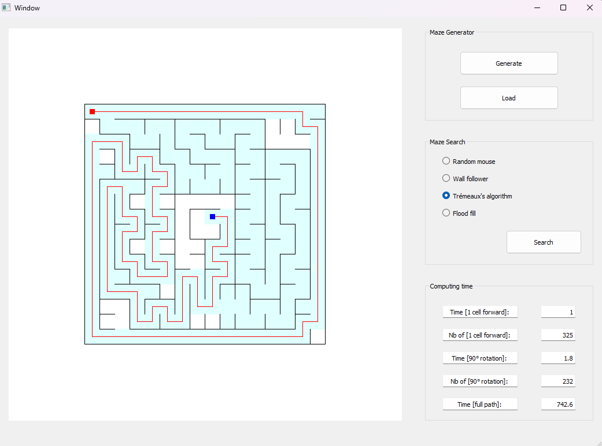

# BlindMaze

A student project for building mazes, solvers and analyzing the results. Based on the *micromouse competition*, a robotics research and academic event.
- The maze structure is not known in advance
- The mouse always starts in the same initial tile, with a given direction
- The mouse discovers the maze tile by tile through its exploration

## Goal

- Implement any algorithm to build an interesting perfect maze
- Build a UI designed to test and show your algorithms graphically (PyQt recommended)
- Implement a random solver
- Implement a wall-follower solver
- Implement a Trémeaux solver
- Implement a floodfill solver

## Details

This project uses pickle files. If you don't trust the source (me), launch `temp.py` once.

## UI Example

